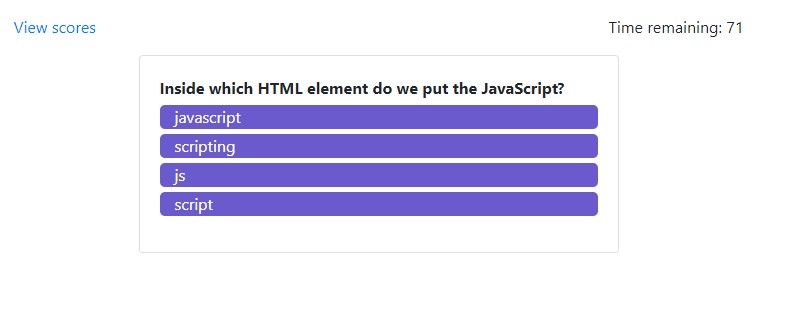
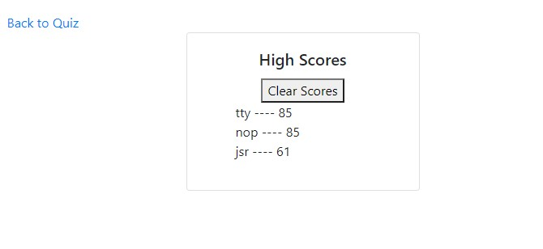

# Timed quiz
* * *
## Installation
In your terminal enter:
git clone https://github.com/detanracnier/BC_10-24_Web_API.git
or if you have set up ssh:
git clone git@github.com:detanracnier/BC_10-24_Web_API.git

## Description
A timed coding quiz with multiple-choice questions. This app will run in the browser, and will feature dynamically updated HTML and CSS powered by JavaScript

## Deployed sight
[here](https://detanracnier.github.io/BC_10-24_Web_API/)

Design reflows for mobile to create a better user experiance

